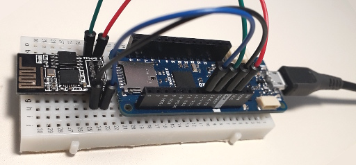

<a href="https://www.buymeacoffee.com/jurajandraY" target="_blank"></a>

# WiFiEspAT library

This library creates standard Arduino WiFi networking API over ESP8266 or ESP32 AT commands. The Arduino WiFi networking API was established by Arduino WiFi library and enhanced by Arduino WiFi101 and Arduino WiFiNINA library.

This library is fast and reliable. It can communicate with AT firmware at high baud rates without flow control, limited only by reliability of UART at chosen speed.

The library is for all Arduino MCU architectures.



## Contents

* [Getting started](#getting-started)
* [Why a new WiFiEsp library?](#Why-a-new-wifiesp-library)
* [Limitations](#limitations)
* [AT firmware versions](#at-firmware-versions)
* [Wiring of ESP module](#wiring-of-esp-module)
* [Baud rate for communication with AT firmware](#baud-rate-for-communication-with-AT-firmware)
* [Persistent WiFi connection](#persistent-wifi-connection)
* [Persistent Access Point](#persistent-access-point)
* [Enhanced WiFi API](#enhanced-wifi-api)
* [Logging](#logging)
* [Sketch size optimization](#sketch-size-optimization)
* [Advanced use](#advanced-use)

## Getting started

* Put AT firmware version 1.7 or 2.4 or higher into the ESP you want to use with the WiFiEspAT library. Make sure the firmware is working and returning OK to test command "AT".


* Wire the ESP module to Serial1 of your Arduino. Wire RX to TX. If your Arduino doesn't have Serial1, wire the ESP module to pins 6 as RX and 7 as TX for SoftwareSerial.


* For AT firmware version 2.4.0 or higher open in the folder of the library the file src/utility/EspAtDrvTypes.h in a text editor and comment out the line `#define WIFIESPAT1` like this `//#define WIFIESPAT1` 


* If you use SoftwareSerial run the ChangeATBaudRate sketch from WiFiEspAT/Tools section in IDE Examples menu. If the sketch ends with "Communication with WiFi module failed!" check the wiring.


* Run the CheckFirmware sketch from WiFiEspAT/Tools section in IDE Examples menu. If the sketch ends with "Communication with WiFi module failed!" check the wiring.


* Open the SetupPersistentWiFiConnection sketch from WiFiEspAT/Tools section in IDE Examples menu. Set the SSID and password on arduino_secrets tab. Run the sketch to make a persistent connection to your WiFi network.


* Try the Basic examples. Warning: The example sketches are designed to present library functions in a simplest way. They are not examples of a good sketch structure and efficiency. Don't use delays and String in your projects. 


## Why a new WiFiEsp library?

This library uses the new passive receive mode implemented in AT firmware 1.7 (Non OS SDK 3) and AT firmware 2.4+ (RTOS SDK). The [older WiFiEsp library](https://github.com/bportaluri/WiFiEsp) can't do much with larger data received. Without the passive receive mode, the AT firmware sends all the data at once and the serial RX buffer overflows. It is hard to receive more data over network with AT firmware without UART hardware flow control and Arduino AVR boards don't have flow control and simple esp8266 modules don't have the flow control pins exposed.

Note: The older WiFiEsp library referenced the AT firmware version by SDK version. This library reports AT commands version.


## Limitations

The official AT firmwares are limited to one TCP server.

### AT 1.7

AT 1.7 is only for esp8266.

The passive receive mode of the AT firmware is not supported for UDP and secure connection (SSL). For this reason UDP received message size is limited to configured buffer size and secure connection (SSL, https) is not supported.

### AT 2

The AT 2 has a small problem with UDP messages in passive receive mode. The received message must be read at once so received message size is limited to configured buffer size with this library.

AT 2 is for esp32. Use at least version 2.4. Versions 2.1 and 2.2 were for esp8266 too, but are not reliable.

Note to 2.0.0 versions: ESP8266 version can't be used with this library. It doesn't support passive receive mode. In ESP32 AT 2.0.0 version UDP doesn't work in passive receive mode.

### Capabilities comparison

The table focuses on limits of AT firmwares in passive receive mode.

|Feature|AT 1.7|AT 2.4+|ESP_ATMod(1)|
|---| :---: | :---: | :---: |
|more than one TCP server|✗|✗|✓|
|SSL server|✗|✓|✗|
|TCP client|✓|✓|✓|
|SSL client|✗|✓|✓|
|SSL client TLS 1.2|✗(3)|✓|✓|
|UDP (2)|✓|✓|✗|
|UDP backlog|✗|✓|n/a| 
|UDP multicast|✗|✓|n/a| 
|SoftAP|✓|✓|✓|
|WPA2 Enterprise|✗|✓|✗|
|epoch time|Lobo|✓|✓|

* (1) [Jiri Bilek's firmware](https://github.com/JiriBilek/ESP_ATMod#description)
* (2) it is not possible to receive UDP message larger than the configured buffer
* (3) it is possible to use the [SSLClient library](https://github.com/OPEnSLab-OSU/SSLClient) for TLS 1.2 on 32bit MCU

## AT firmware versions

You can use the CheckFirmware sketch from examples Tools to check the version of the AT firmware.

### AT 1.7

AT firmware 1.7.x is build on Espressif NonOS SDK 3. 

The Espressif AT binary is built for 2MB-c1 flash partitioning. Flash Download Tool corrects it for 4 MB flash, but for esptool you should use the `--flash_size 2MB-c1` option and the corresponding addresses.

```
esptool.py write_flash --flash_size 2MB-c1 0x0 boot_v1.7.bin 0x01000 at/1024+1024/user1.2048.new.5.bin 0x1fb000 blank.bin 0x1fc000 esp_init_data_default_v08.bin 0xfe000 blank.bin 0x1fe000 blank.bin
```

The AT 1.7.4 version has bin file for flashing to 1 MB flash.

```
esptool.py write_flash --flash_size 1MB 0x0 boot_v1.7.bin 0x01000 at/512+512/user1.1024.new.2.bin 0xfb000 blank.bin 0xfc000 esp_init_data_default_v08.bin 0xfe000 blank.bin 0x7e000 blank.bin
```

For some esp8266 modules you will have to add `--flash_mode dout` before `--flash_size`.

GitHub user loboris (Boris Lovosevic) builds customized versions of AT firmware with SDK 3 for all flash sizes. You can download the files from his [ESP8266_AT_LoBo GitHub repository](https://github.com/loboris/ESP8266_AT_LoBo). Run his flash.sh utility to flash the correct binary.

Jiri Bilek created [an alternative AT 1.7 firmware implementation](https://github.com/JiriBilek/ESP_ATMod) over esp8266 Arduino core and WiFi library. This supports SSL TLS1.2 connection in passive mode with this library. This firmware doesn't yet support UDP.

Resources:
* [the Espressif binaries](https://github.com/espressif/ESP8266_NONOS_SDK/releases) - versions 1.7.x in NONOS SDK 3.0.x
* [AT 1.7 reference](https://www.espressif.com/en/support/documents/technical-documents?keys=Non-OS+AT&field_type_tid%5B%5D=14) - it contains firmware flashing instructions too
* [AT LoBo flashing instructions](https://github.com/loboris/ESP8266_AT_LoBo/#flashing). First install esptool.py. If you download the AT LoBo repository as zip, it contains the firmware binaries and a script to flash them.
* [Jiri Bilek's ESP_ATMod](https://github.com/JiriBilek/ESP_ATMod)

### AT 2

This library can work with AT firmware version 2.4 or higher. AT firmware 2 is for ESP32 and is build on Espressif's IDF framework. 

The flashing command of AT2 with esptool is `esptool.py write_flash @download.config`. I recommend to change in download.config file flash_mode to qio if your ESP module supports it and flash frequency to 40MHz if your module doesn't support 80MHz.

Resources:
* [the Espressif AT2 binaries](https://docs.espressif.com/projects/esp-at/en/latest/AT_Binary_Lists/index.html)
* [the Espressif AT2 releases on GitHub](https://github.com/espressif/esp-at/releases)

### Flashing tools

* [Flash Download Tool](https://www.espressif.com/en/support/download/other-tools?keys=&field_type_tid%5B%5D=14) It is Windows only, but can detect settings of your ESP and apply them to the flashed settings binary
* [esptool.py installation instructions](https://github.com/espressif/esptool#installation--dependencies)

## Wiring of the ESP module

The examples of this library expect the AT firmware's RX/TX wired to hardware Serial1 for boards with Serial1. For AVR boards without Serial1 the examples setup SoftwareSerial on pins 6 (RX) and 7 (TX). Wire RX to TX.

To use hardware reset instead of software reset, wire selected pin of Arduino to reset pin of the ESP and set the pin as second parameter in WiFi.init(Serial1, ESP_RESET_PIN);. No logic level conversion is required for this connection. The library only sets the pin LOW or floating.

You can use the SerialPassthrough sketch from WiFiEspAT/Tools in IDE Example menu to bridge the ESP to computer over Arduino with the above wiring. You can then send AT commands to the AT firmware from the Serial Monitor. It is even possible to upload AT firmware if the ESP is on hardware Serial. Only put the ESP in flashing mode and set the upload baud rate to 115200 baud.


## Baud rate for communication with AT firmware

Over hardware Serial this library works reliably with AT firmware's default 115200 baud. With SoftwareSerial, 9600 baud should be used because of limitations of SoftwareSerial. You can try alternative software Serial libraries with their recommended baud rates. The ChangeBaudRate sketch in examples Tools section can change over SoftwareSerial the default baud rate of AT firmware from 115200 to 9600 baud. 

For hardware serial high baud rates can be used. For Arduino Mega 500000 baud works good. The ChangeBaudRate sketch can be used to change the default baud rate of the AT firmware to a higher one for hardware Serial. For example a WebServer serving web files from SD card requires high baud rate to be able to serve multiple files one after other fast enough.


## Persistent WiFi connection

The ESP can remember the WiFi network settings to connect automatically to WiFi network after power-up or reset. This library supports this with the SetupWiFiConnection example tool sketch. The sketch uses the WiFi.setPersistent() setting. After the connection is successful, it is remembered by the ESP and set for autoconnect at start. Other sketches don't need to call WiFi.begin(), only wait until WiFi.status() returns WL_CONNECTED.

Note: The ESP SDK remembers the SSID and password by default and uses them to autoconnect at start. Your ESP may have remembered setting from previous use with any firmware or Arduino sketch.

Using persistent connections has two benefits. The sketch size is smaller without WiFi.begin() and the connection to network is asynchronous, it happens while other devices are setup in setup(). (Synchronous WiFi.begin() with DHCP waits 5 seconds for the OK from AT firmware.)

WiFi.disconnect() in 'persistent mode' or WiFi.disconnect(true) clear the remembered connection and disables automatic connection to network. Don't use persistent WiFi.begin(ssid, pass) and persistent WiFi.disconnect() in the same sketch. The settings would be written to flash and then cleared repeatedly, which would lead to faster ESP flash memory wearing.

With WiFi.setAutoConnect(false) the remembered network settings are not used, but stay remembered. If ESP auto starts the connection, it can collide with WiFi.begin(). Clear the persistent connection with WiFi.disconnect() before using a temporary not persistent connection.


## Persistent Access Point

This library supports ESP SoftAP control over AT firmware. With WiFi.beginAP() without parameters the SoftAP is started with default settings. Default settings are factory settings or remembered persistent settings. The SetupPeristentAP example tool can be used to setup SoftAP with custom SSID and optionally setup encryption/password and IP address for the SoftAP.

Use WiFi.endAP(true) to disable start of SoftAP at ESP startup. It will not clear the persistent AP settings.


## Enhanced WiFi API

This library implements Arduino WiFi networking API. The last version of this API is defined by the [Arduino WiFiNINA library](https://www.arduino.cc/en/Reference/WiFiNINA). The WiFiEspAT library has some differences.

### the WiFi object differences

* `init` command to set the Serial interface used for communication
* `begin` for AT 1.7 begin() without parameters (joining remembered WiFi) is not available
* `beginEnterprise` AT 2 only. to connect to WPA2 Enterprise network (sorry, it is not tested)
* `setPersistent` to set the remembering of the following WiFi connection (see the SetupPersistentWiFiConnection.ino tool example)
* `setAutoConnect` to set the automatic connection to remembered WiFi AP
* `scanNetworks` optionally can be called with array of type `WiFiApData[]` to fill
* `hostname` to get the hostname. can be called with char array to fill (see PrintPersistentSettings.ino tool example)
* `SSID` optionally can be called with char array to fill (see PrintPersistentSettings.ino tool example)
* `dhcpIsEnabled` to determine if DHCP or static IP is used (see PrintPersistentSettings.ino tool example)
* `beginAP` can be called without parameters to start the persistent AP (see ConfigurationAP.ino example)
* `endAP` - stops the AP. `endAP(true)` stops the AP and disables start of persistent AP at startup
* `configureAP` - to configure AP. see the SetupPersistentAP.ino tool example
* AP parameters getters - apMacAddress, apSSID, apPassphrase, apEncryptionType, apMaxConnections, apIsHidden, apDhcpIsEnabled, apIP, apGatewayIP, apSubnetMask (see PrintPersistentSettings.ino tool example)
* `startMDNS` to execute AT+MDNS. refer to AT reference for parameters
* `sntp` - to enable and configure SNTP servers. see SNTPTime.ino example
* `reset` - to reset or wake-up the ESP. see DeepSleepAndHwReset.ino example
* `sleepMode`- to set the level of automatic sleep mode. possible modes are WIFI_NONE_SLEEP, WIFI_LIGHT_SLEEP and WIFI_MODEM_SLEEP
* `deepSleep`- to turn-off the ESP. see DeepSleepAndHwReset.ino example
* `ping` doesn't have the ttl parameter and returns only true or false

### the WiFiClient class differences

* `connectSSL` is not supported with standard AT 1 firmware
* `write(file)` variant of write function for efficient sending of SD card file. see SDWebServer.ino example 
* `write(callback)` variant of write function for efficient sending with a callback function. see SDWebServer.ino example 
* `abort` AT1 only. closes the TCP connection without waiting for the remote side 

### the WiFiServer class differences

The standard AT firmwares support only one TCP server. The ESP_ATMod firmware supports multiple servers.

* `begin` has optional parameters maxConnCount (default 1) and serverTimeout in seconds (default 60)
* `beginSSL` ESP32 only. starts the server for secure connections.
* `end` to stop the server (the Arduino WiFi libraries can't stop a server)
* `accept` like in new [Ethernet library](https://www.arduino.cc/en/Reference/EthernetServerAccept). see the AdvancedChatServer  

The WiFiServer class in this library doesn't derive from the Arduino Server class. It doesn't implement the never used 'send to all clients' functionality over Print class methods (print, write). For 'send to all clients' use the WiFiServerPrint class as the PagerServer example.

### the UDP differences

The Arduino UDP API requires to start a listening port to send an UDP message. This library doesn't require udp.begin() before udp.beginPacket(). 

* `beginMulticast` works only with AT2
* `availableForParse` for AT2 only. returns the size of the available message. see the WiFiEspAT2UDP example
* `parsePacket(buffer, size, ip, port)` for AT2 only. to read the message into provided buffer. see the WiFiEspAT2UDP example 
* `write(callback)` variant of write function for efficient sending with a callback function

You can use WiFiUdpSender class if you only send messages. See the UdpSender.ino example.

With AT2 You can use WiFiEspAtUDP class if you receive messages with the `parsePacket(buffer, size, ip, port)` function. WiFiEspAtUDP doesn't have internal buffer to receive the message with `parsePacket()` so it saves global memory. See the WiFiEspAT2UDP example. 

## Logging

The EspAtDrv in center of the library has four logging levels to troubleshoot communication with AT firmware or help with development of new functions. At default logging is off, set to SILENT level.

Logging level and logging Serial instance, can be changed in src/utils/EspAtDrvLogging.h. Level DEBUG will print all AT commands and responses from AT firmware. Level ERROR will print only errors in communication with AT firmware. Higher logging level result in larger sketch size.


## Sketch size optimization

For small MCU like the ATmega328p on Uno, the sketch size matters. With modern compiler and linker almost all not used code is removed. So any additional function used in sketch results in larger sketch. Any function called to get information about the WiFi connection only to print a fancy welcome message adds to sketch size. 

With persistent WiFi connection WiFi.begin() and underlying functions are not used, resulting in smaller sketch size.

Use WiFiUdpSender class if you only send UDP messages. You can use WiFiEspAtUDP with AT2. WiFiUDP always allocates the receive buffer required for AT1 UDP receive without passive mode and for AT2 to fulfill the Arduino UDP API.


## Advanced use

### Buffering and buffers

This library has small buffers in WiFiClient to achieve better performance over UART and over network. The size of the buffers is configured in WiFiEspAtConfig.h file in library's src folder. There is a special set of settings for AVR MCU with small SRAM. For small SRAM, the RX and TX buffer are 32 bytes, for all other it is 64 bytes.

For UDP to hold the composed message and the received message 64 bytes buffers are used for small AVR MCU and 256 bytes buffers for other MCU. 

It is recommended to use WiFiClient.flush() after completing the output. WiFiClient.stop() and WiFiUdp.endPacket() both call flush(). The library calls flush() if TX buffer is not empty and available() is called.

The buffers size can be changed in WiFiEspAtConfig.h or set on build command line. The TCP TX buffer can be set to 0 and the RX buffer must be at least 1 (for peek()), but then please use buffers in sketch for example with [StreamLib's](https://github.com/jandrassy/StreamLib) wrapper class BufferedPrint. 

The size of the UDP TX buffer can be set to zero in WiFiEspAtConfig.h if the complete message is sent with one print(msg), one write(msg, length) or with write(callback). Otherwise the size of the UDP buffers limits the size of the message. If the composed message is larger than the buffer it will be send as partial UDP messages. If the size of received message with AT1 is larger than the UDP TX buffer, the message will be dropped (with WiFi.getLastDriverError() set to EspAtDrvError::UDP_LARGE).

To set different custom sizes of buffers for different boards, you can create a file boards.local.txt next to boards.txt file in hardware package. Set build.extra_flags for individual boards. For example for Mega you can add to boards.local.txt a line with -D options to define the macros.

mega.build.extra_flags=-DWIFIESPAT_TCP_RX_BUFFER_SIZE=128 -DWIFIESPAT_TCP_TX_BUFFER_SIZE=128

With WiFiEspAT library the incoming data are buffered at two levels. First level is in the AT firmware. After it received all the data to buffer and closed the connection, the yet unread data are still available to read. Second buffering is in library's BuffStream. Here still can be data available even the firmware and EspAtDrv are done with the link and it can be used for a new connection. 

### the `write(callback)` function

While the internal buffering of the library and the use of Nagle's algorithm by AT firmware prevents sending client.prints in many very very small TCP packets, with the write(callback) function all prints executed in the callback function are send to AT firmware with one AT+CIPSENDEX command resulting in efficient TCP or UDP packet size. AT+CIPSENDEX is limited to 2 kbytes and `\\0` terminates the command so it can't occur in data. 

The SDWebServer example shows the use of the `write(callback)` function with C++ anonymous lambda functions as callbacks.

### EspAtDrv Errors

The library functions with bool as return type return false in case of fail. The functions which return a value return 0 or - 1 in case of error, depending on the semantic of the function. To get the reason of the error the sketch can test the WiFi.getLastDriverError(). The error codes are enumerated in util/EspAtDrvTypes.h.

For some functions 0 or false as returned value can have a meaning of error or be a valid return value. For example if you call `readBytes`, which has unsigned return type, without previously testing if bytes are available, then returned 0 can have the meaning of no bytes available or error occurred.

### UART Flow Control

The AT firmware sends notifications about different events without the host requesting them. Examples of these events are if data arrive for a connection or connection is closed. Without flow control of Serial interface some of these events can get lost in buffer overflow if they arrive in bulk. As compensation for lost events, the WiFiEspAT library polls the state of the connections. This adds to time spent in library functions.

If you can setup for the WiFiEspAT library a Serial connection with flow control, you can uncomment `#define ESPATDRV_ASSUME_FLOW_CONTROL` in EspAtDrv.cpp or define ESPATDRV_ASSUME_FLOW_CONTROL in boards.local.txt for the board. This will remove the polling of connections state.

The SerialPassthrough sketch from WiFiEspAT/Tools in IDE Example menu has optional configuration of SAMD SERCOM3 to create 'Serial' interface with flow control. The esp8266 CTS pin is pin 13. The example has pin 2 of MKRZERO as RTS pin. To activate flow control on the AT firmware side, use the AT+UART command with last parameter 2 or 3.

### Create a copy for AT2

If you want to use the library in projects with AT1 and AT2, create for AT2 a copy of the library. Copy the folder of the library as WiFiEspAT2, rename the file WiFiEspAT.h to WiFiEspAT2.h and change in library.properties `includes=` to `WiFiEspAT2.h`.